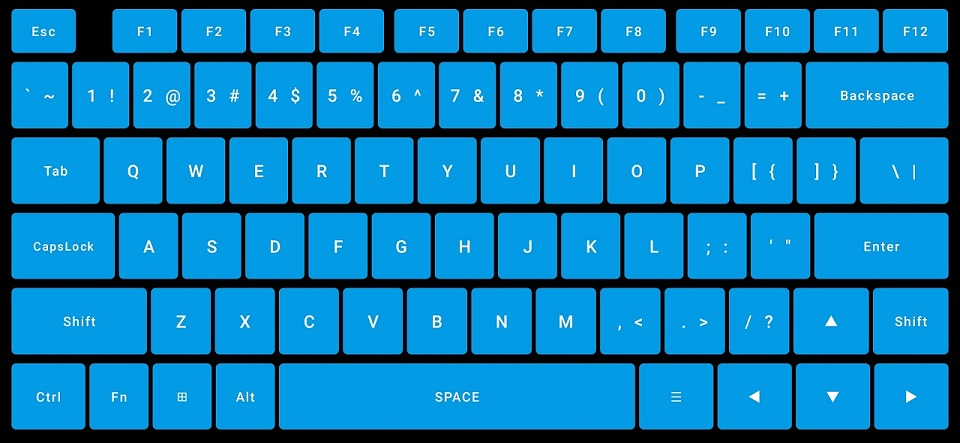
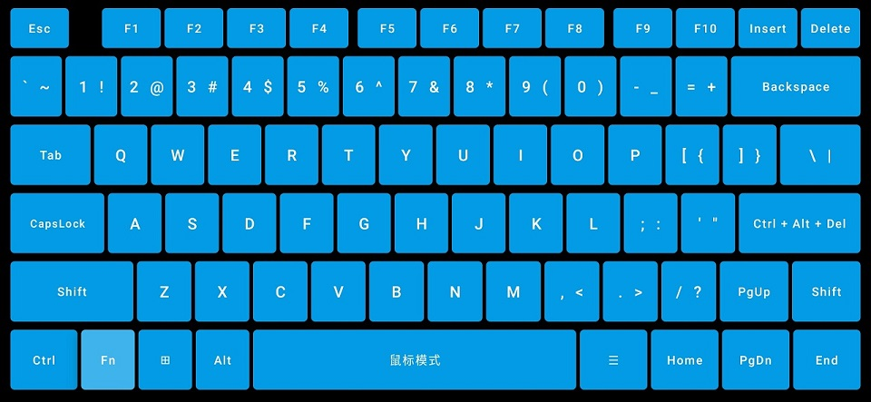
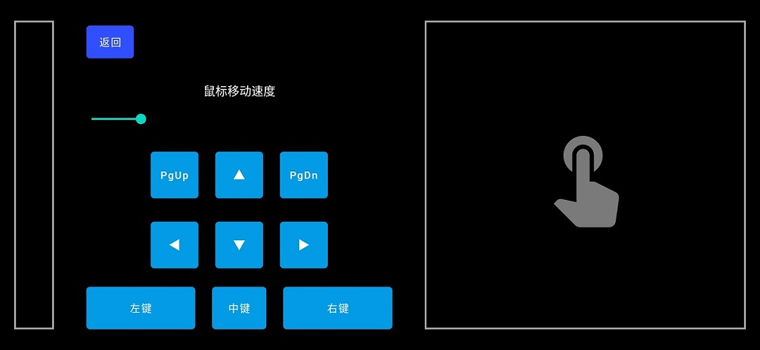

# Android HID Keyboard

将你的 Android 手机变成即插即用的 USB 键盘 & 鼠标！  
可用于控制 PC，智能电视，手机等支持 USB 输入的设备，受控端不需要权限或安装软件  
鼠标支持 X/Y 轴相对移动，滚轮按下、滑动，左右键  
键盘支持常用的按键，最高支持控制键+6个普通按键的同时输入  
原理可参考[How does it work?](https://github.com/tejado/android-usb-gadget#how-does-it-work)

### 使用方法：

* Android 设备获取 root 权限
* 安装[USB Gadget Tool](https://github.com/tejado/android-usb-gadget)，并检查是否支持
* 在 USB Gadget Tool 内添加 Mouse & Keyboard 功能并启用
* 安装运行[本软件](https://github.com/Sucareto/Android_HID_Keyboard/releases/latest)，授予 root 权限后，用 USB 数据线将
  Android 设备连接到受控端即可按键输入

### 界面预览：

* 键盘主界面：  
  
* 键盘按下 Fn 后：  
  
* 鼠标主界面：  
  

### 已测试设备：

* OnePlus 7 Pro (guacamole) Oxygen OS 11.0.9.1.GM21BA
* OnePlus 13T (pagani) ColorOS 15.0 PKX110_15.0.2.107(CN01)

### 项目现状：

* 基本功能已实现，但因为 Android 开发经验不足，无法继续优化和实现新功能，暂时停止更新。
* 目前键盘布局、按钮监听的实现效率低下，可能会出现卡键的状态，需要重新实现更好的布局方案。
* 写入 HID 数据用的是 SuFileOutputStream，只能写入无法读取，需要寻找更好的实现。
* 创建 HID 设备操作依赖 USB Gadget Tool 实现，且只能创建键盘 & 鼠标，也许可以在本程序内实现一个创建 HID 设备的功能页。

### 感谢：

* [USB Gadget Tool](https://github.com/tejado/android-usb-gadget)：启用了 Android 的 HID 设备功能
* [android-keyboard-gadget](https://github.com/pelya/android-keyboard-gadget)：提供了发送按键操作示例
* [libsu](https://github.com/topjohnwu/libsu)：提供了 root 操作相关库
* [sjy0079](https://github.com/sjy0079)：提供了编码思路，指导了代码编写
* [メリーゴーランド](https://twitter.com/adashima_staff/status/1321866890294210560)：写代码时听的歌
* [一加手机型号汇总](https://github.com/KHwang9883/MobileModels/blob/master/brands/oneplus.md)：手机代号列表
