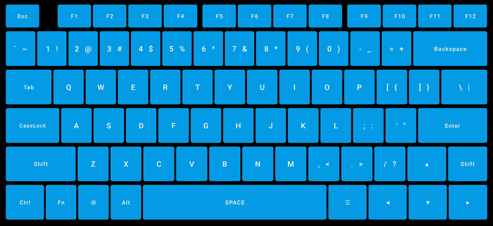

# Android HID Keyboard
用 Android 设备实现的 HID 键盘。  
将你的 Android 手机变成即插即用的 USB 键盘！  
可用于控制 PC，智能电视，手机等支持 USB 键盘的设备，受控端不需要权限或安装软件。  

### 使用方法：
* Android 设备获取 root 权限
* 安装[USB Gadget Tool](https://github.com/tejado/android-usb-gadget)，并检查是否支持
* 在 USB Gadget Tool 内添加 Mouse & Keyboard 功能并启用
* 安装运行本软件，授予 root 权限后，用 USB 数据线将 Android 设备连接到受控端即可按键输入
* 最高可支持控制键+6个普通按键的同时输入，原理可参考[How does it work?](https://github.com/tejado/android-usb-gadget#how-does-it-work)

### 界面预览：

### 已测试设备：
* OnePlus 7 Pro (guacamole) Oxygen OS 11.0.3.1.GM21AA

### 感谢：
* [USB Gadget Tool](https://github.com/tejado/android-usb-gadget)：启用了 Android 的 HID 设备功能
* [android-keyboard-gadget](https://github.com/pelya/android-keyboard-gadget)：提供了发送按键操作示例
* [libsu](https://github.com/topjohnwu/libsu)：提供了 root 操作相关库
* [sjy0079](https://github.com/sjy0079)：提供了编码思路，指导了代码编写
* [メリーゴーランド](https://twitter.com/adashima_staff/status/1321866890294210560)：写代码时听的歌
